# AWS VPC using Terraform

In our previous project, we manually created a VPC, subnets, route tables, and other services in AWS. While this approach worked, doing things manually can be time-consuming and prone to errors. Imagine if you had to create hundreds of resources—doing it one by one would be overwhelming.

In the world of DevOps, automation is your best friend. Automating tasks not only saves time but also reduces the risk of human error. This is where Infrastructure as Code (IaC) comes into play. IaC allows you to define your infrastructure using code, making it repeatable, consistent, and scalable.

Two popular tools for IaC are Terraform and CloudFormation, but in this project, we’ll be focusing on Terraform.

# What is Infrastructure as Code (IaC)?

Infrastructure as Code (IaC) is a key DevOps practice that involves managing and provisioning computing infrastructure through machine-readable configuration files, rather than through physical hardware configuration or interactive configuration tools. This approach brings several benefits:

1. Automation: Automating the setup of infrastructure reduces manual errors, increases efficiency, and speeds up the deployment process. Consistency: Ensures that the same environment is provisioned every time, reducing discrepancies between different environments (e.g., development, testing, production).

2. Version Control: Infrastructure configurations can be versioned and stored in repositories (e.g., Git), allowing teams to track changes, revert to previous states, and collaborate more effectively.

3. Scalability: IaC makes it easier to scale infrastructure up or down by simply modifying the configuration files.

# Why Use Terraform?

Terraform is a popular IaC tool developed by HashiCorp. It allows you to define, provision, and manage infrastructure across various cloud providers and services using a high-level configuration language. Some of the key features and benefits of Terraform include:

1. Multi-Provider Support: Terraform supports a wide range of cloud providers (e.g., AWS, Azure, Google Cloud), making it a versatile tool for managing infrastructure across different platforms.

2. Declarative Language: Terraform uses a declarative language (HashiCorp Configuration Language - HCL) to define infrastructure. This means you describe the desired state of your infrastructure, and Terraform takes care of achieving that state.

3. State Management: Terraform keeps track of the state of your infrastructure, allowing it to detect changes and apply only the necessary updates. This state management is crucial for maintaining the consistency of your infrastructure.

4. Modularity: Terraform supports the use of modules, which are reusable components that encapsulate specific pieces of infrastructure. This modularity promotes code reuse and simplifies the management of complex infrastructures.

5. Community and Ecosystem: Terraform has a vibrant community and a rich ecosystem of providers and modules, making it easier to find resources and get support.

# This guide provides an overview of key Terraform commands to help you manage your infrastructure efficiently.

**terraform init**

**Purpose:** Initializes a new or existing Terraform working directory.

**Usage:** Prepares your directory for Terraform operations by downloading necessary provider plugins.

terraform init

**terraform plan**

**Purpose:** Creates an execution plan showing what changes Terraform will make to your infrastructure.

**Usage:** Review planned changes before applying them.

terraform plan

**Terraform apply**

**Purpose:** Applies the changes required to reach the desired state as defined in your configuration files.

**Usage:** Executes the actions proposed by terraform plan.

terraform apply

**Terraform destroy**

**Purpose:** Destroys the Terraform-managed infrastructure.

**Usage:** Removes all resources defined in your configuration files.

terraform destroy

**Terraform validate**

**Purpose:** Validates the configuration files for syntax and internal consistency.

**Usage:** Checks for errors before running other commands.

terraform validate

**Terraform fmt**

**Purpose:** Formats Terraform configuration files to follow a canonical style.

**Usage**: Ensures consistent formatting of your configuration files.

terraform fmt

**Terraform show**

**Purpose:** Displays a human-readable output of the state or plan.

**Usage:** Inspects the current state or details of a plan.

terraform show

**Terraform output**

**Purpose:** Reads and displays the values of output variables from the state file.

**Usage:** Accesses outputs defined in your configuration.

terraform output

**terraform state**

**Purpose:** Advanced management of the Terraform state file.

**Usage:** Includes subcommands to inspect and modify the state.

terraform state list

For more detailed information about this commands, visit the Terraform Documentation.

# To do this project you need to have the following.

1. A Valid AWS account with full permissions to create and manage AWS VPC service.

2. Setup terraform on an ec2 instance, ensure you have a valid IAM role attached to the instance with VPC provisioning permissions.

We are going to spin up an ec2 instance and attach the following IAM roles to it:

- AmazonVPCFullAccess

- AmazonEC2FullAccess

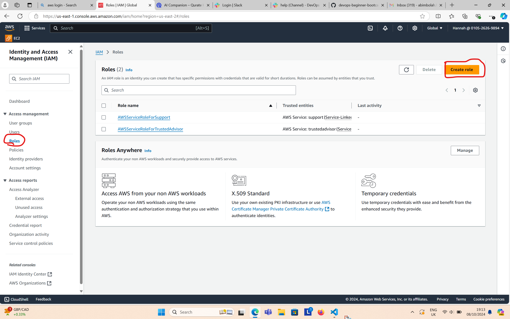

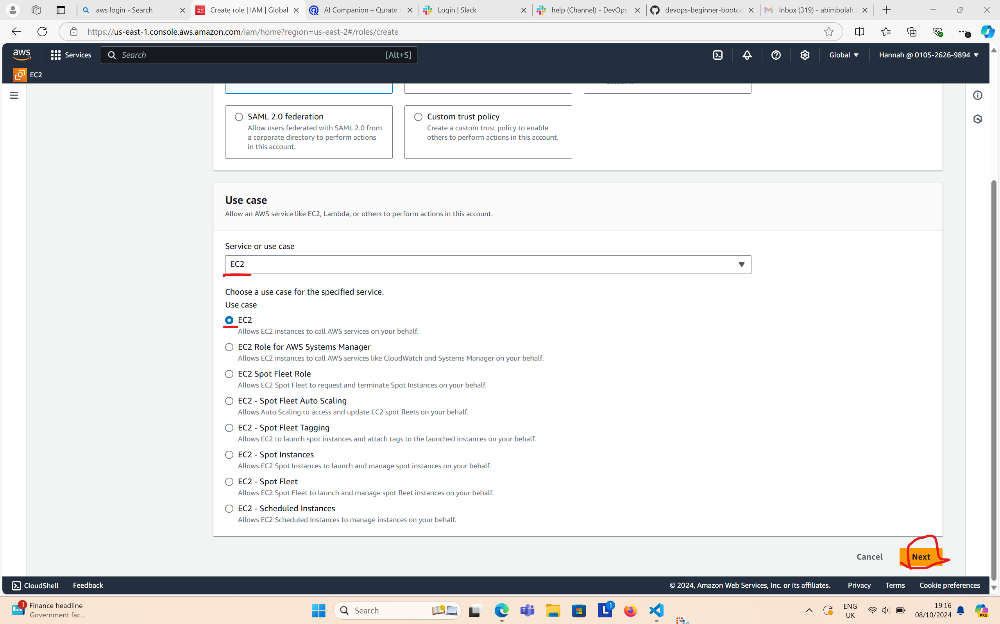

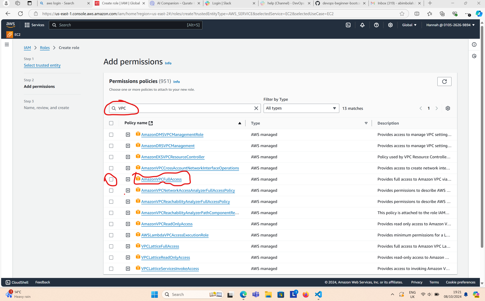

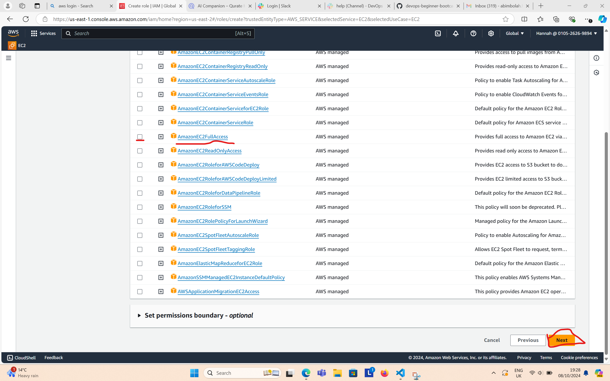

# Now create an EC2 instance, Ubuntu 22.04

# let us the attach the role created earlier to the instance

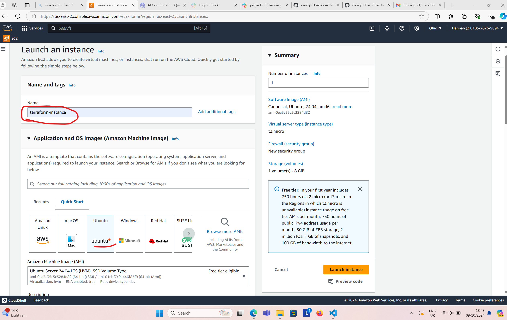

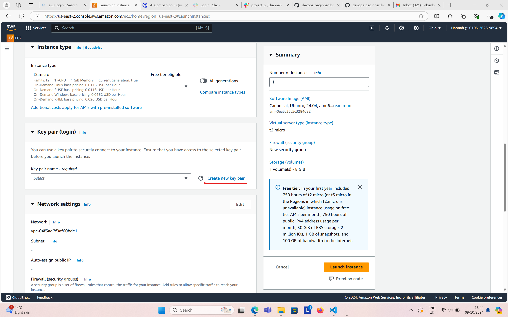

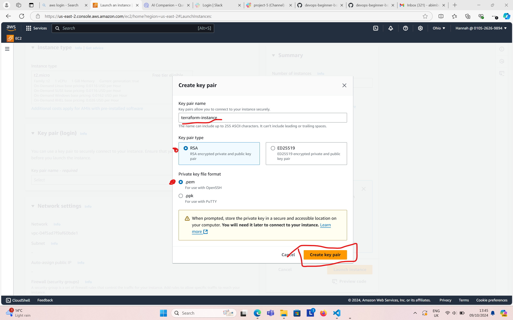

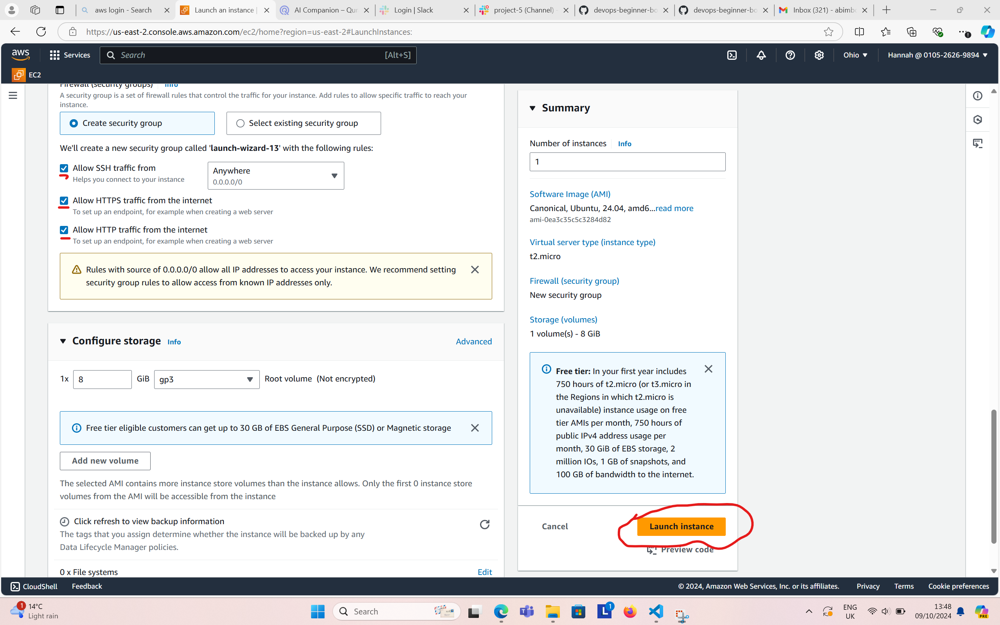

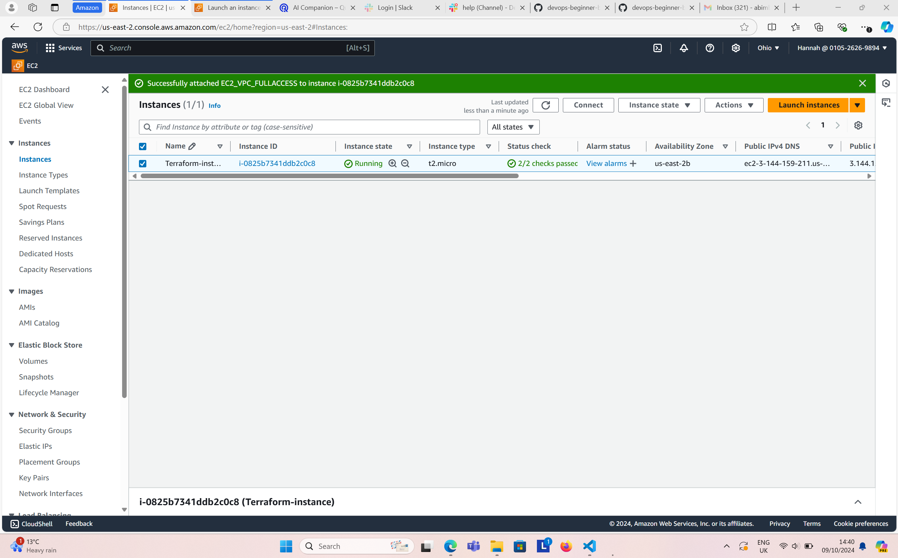

# Connect to your instance via ssh

- ssh into the instance

- install terraform

sudo snap install terraform

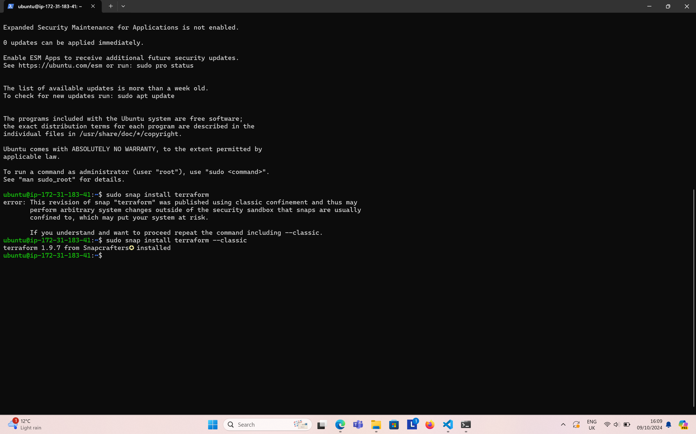

# Terraform AWS VPC Creation Workflow

Note: The VPC and subnets for this demo is created based on the VPC design document.

We will be creating the VPC with the following

1. CIDR Block: 10.0.0.0/16

2. Region: us-west-2

3. Availability Zones: us-west-2a, us-west-2b, us-west-2c

4. Subnets: 15 Subnets (One per availability Zone)

5. Public Sunets (3)

6. App Subets (3)

7. DB Subnets (3)

8. Management Subnet (3)

9. Platform Subnet (3)

10. NAT Gateway for Private subnets

11. Internet Gateway for public subnets.

# Step 1: Clone thge repo into the instance and CD in the Cloned Repository

- clone it using the following command.

git clone https://github.com/TobiOlajumoke/Terraform-VPC.git

- Then cd in to the terraform-vpc folder

cd terraform-vpc

The VPC terraform code is structured in the following way.

;
├── infra
│   └── vpc
│       ├── main.tf
│       └── variables.tf
├── modules
│   └── vpc
│       ├── endpoint.tf
│       ├── internet-gateway.tf
│       ├── nacl.tf
│       ├── nat-gateway.tf
│       ├── outputs.tf
│       ├── route-tables.tf
│       ├── subnet.tf
│       ├── variables.tf
│       └── vpc.tf
└── vars
    └── dev
        └── vpc.tfvars

        vars folder contains the variables file named vpc.tfvars. It is the only file that needs modification

The modules/vpc folder contains the following VPC related resources. All the resource provisioning logic is part of these resources.

1. endpoint

2. internet-gateway

3. nacl

4. nat-gateway

5. route-tables

6. subnet

7. vpc The infra/vpc/main.tf file calls all the vpc module with all the VPC resources using the variables we pass using the vpc.tfvars file

# Step 2

- - cd into vars/dev/vpc.tfvars . Do it this way

cd vars            (Navigate to the vars directory)

cd dev             (Navigate to the dev directory inside vars)

cd vpc.tfvars      (This is the file itself, you cannot navigate into a file)

- using any text editor of your choce Nano or VIM and change the #tag owner to your name eg "Femi" in this demo i used "DevOps"

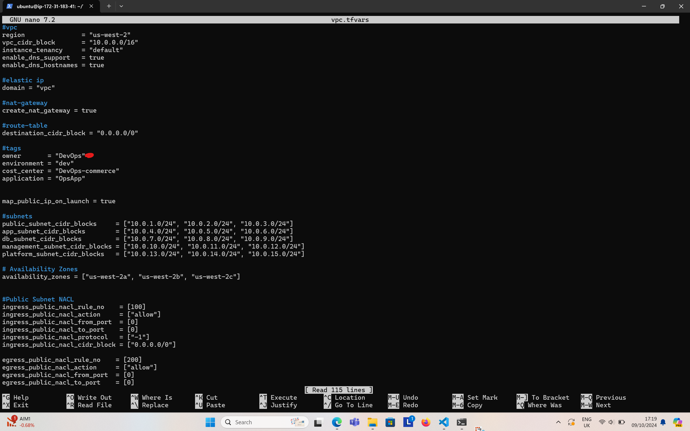

Edit under #Tag  - Owner as your name . i.e OWner = Abimbola

# Step 2: Initialize Terraform and Execute the Plan

- Now cd in to infra/vpc folder and execute the terraform plan to validate the configurations.

cd infra/vpc

This command is used to change into the directory where your Terraform files for creating the VPC are located. In this case, you're moving into the infra/vpc directory.

Firstly initialize Terraform

terraform init

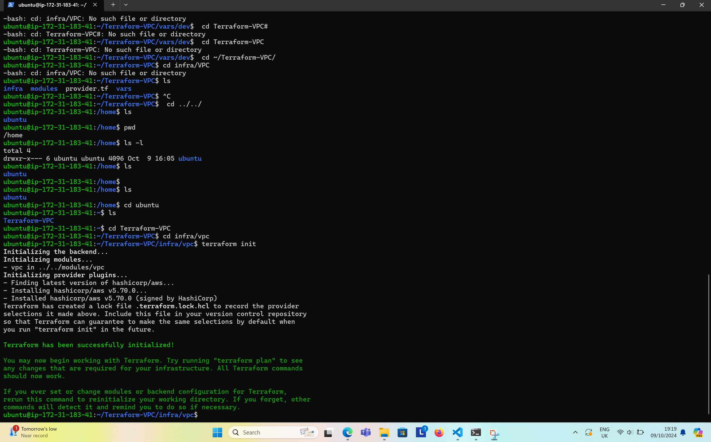

This step is necessary to set up Terraform for the project. It will download any plugins (like AWS) Terraform needs and prepare your project. You only need to do this once when you start working with Terraform in a new directory.

Execute the plan

terraform plan -var-file=../../vars/dev/vpc.tfvars

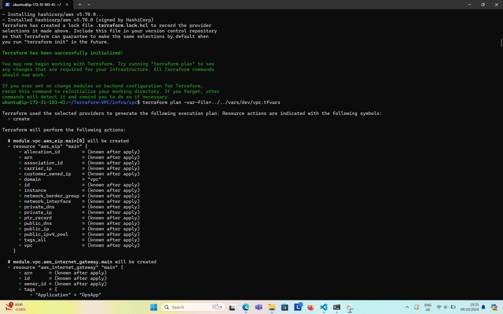

The plan command shows you what changes Terraform will make to your AWS resources. The -var-file is pointing to the file that contains specific values (like network ranges) for the development environment (dev). After running this command, you’ll get an output showing what Terraform plans to create or modify (like the VPC, subnets, and gateways).

You should see an output with all the resources that will be created by terraform.

# Step 3: Create VPC With Terraform Apply

Lets create the VPC and related resources using terraform apply.

terraform apply -var-file=../../vars/dev/vpc.tfvars

This is where you tell Terraform to actually create the resources on AWS. It will use the values from the vpc.tfvars file and make the necessary changes. You’ll see a summary of the changes before proceeding, and you have to confirm (by typing yes) to allow Terraform to create the VPC, subnets, internet gateways, etc.

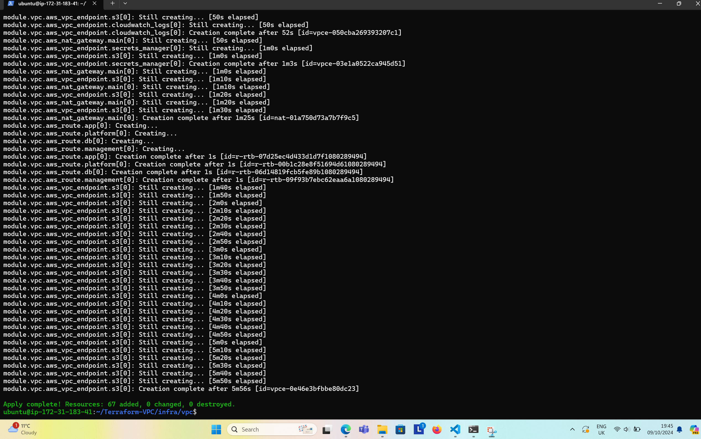

# Step 4: Validate VPC

Head over to the AWS Console the check the Resource Map of the VPC.

Click on the created VPC and scroll down to view the Resource Map.

You should see 15 subnets , 6 route tables, internet gateway and NAT gateway as shown below.

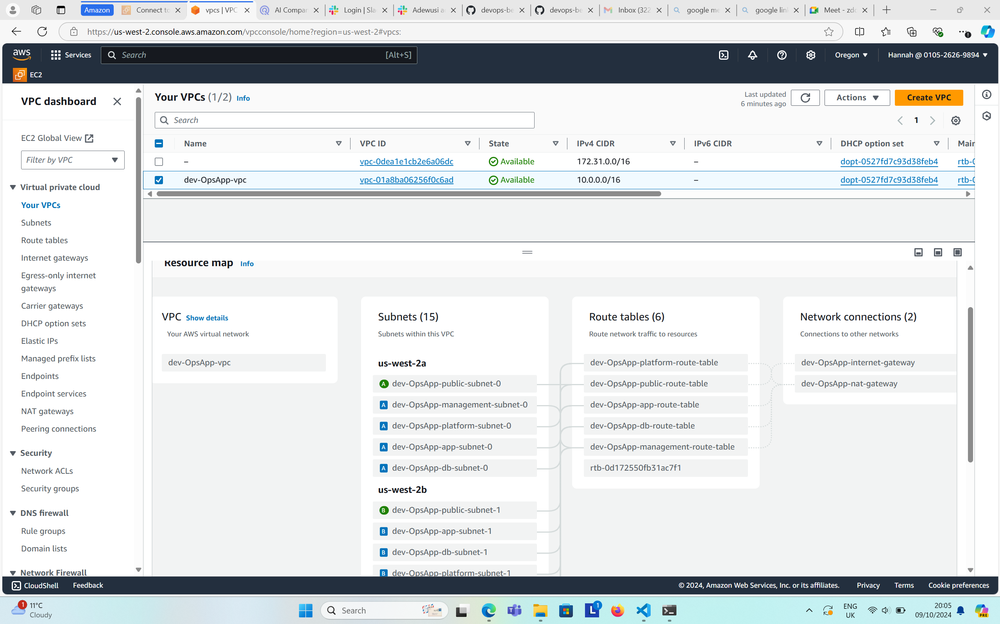

# Step 5: Cleanup the Resources

- clean up the resources created by Terraform, execute the following command

terraform destroy  -var-file=../../vars/dev/vpc.tfvars

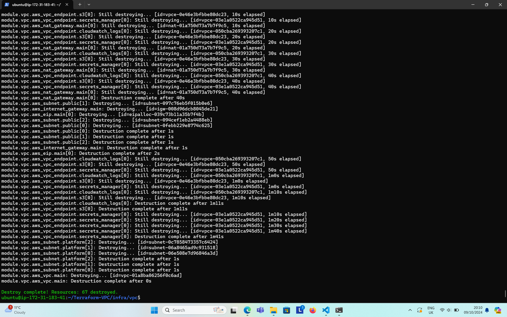

- You can go ahead and terminate your instance you created also

